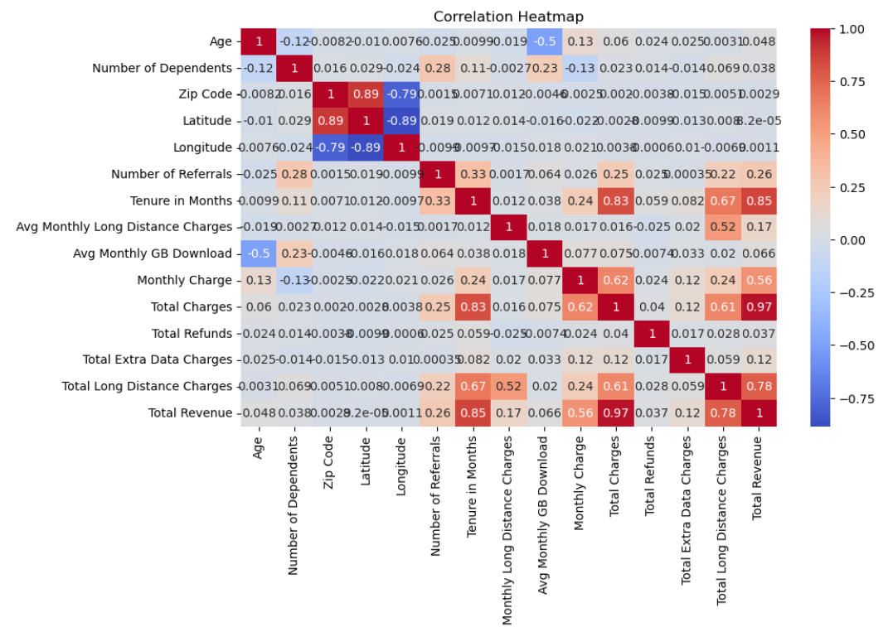
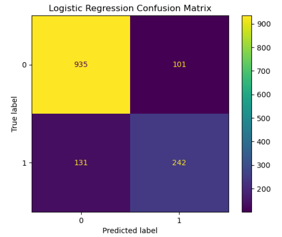
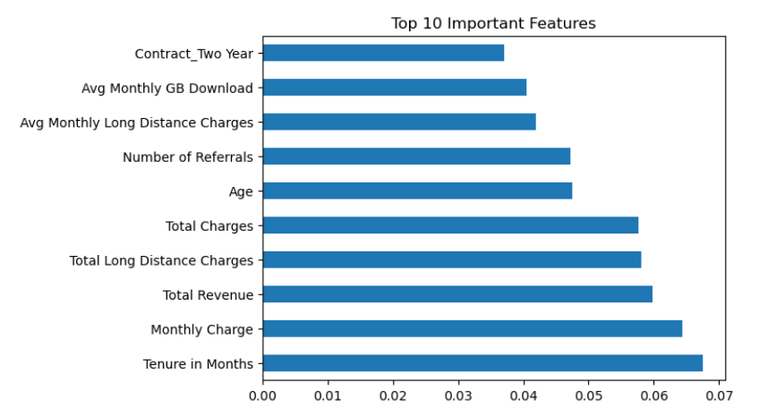

# Telecom Customer Churn Prediction using Machine Learning

## Project Overview
This project focuses on predicting customer churn in the telecommunications industry using Machine Learning techniques. Customer churn prediction helps telecom companies identify customers who are likely to discontinue their services, allowing businesses to take proactive retention measures.

The project was developed as part of an MSc Data Science Machine Learning assignment and demonstrates a complete end-to-end machine learning pipeline, including data preprocessing, exploratory data analysis, feature engineering, model building, model optimisation, and performance evaluation.

---

## Problem Statement
Customer churn is one of the major challenges faced by telecom companies. Losing existing customers can significantly impact company revenue and business growth. The objective of this project is to build predictive machine learning models capable of classifying whether a customer is likely to churn based on customer demographics, service usage, billing information, and subscription behaviour.

---

## Dataset Information
- Dataset: Telecom Customer Churn Dataset
- Source: Kaggle
- Total Records: 7043
- Initial Features: 37
- Final Features after preprocessing: 31

The dataset contains customer information such as:
- Demographics
- Service subscriptions
- Billing details
- Internet usage
- Contract information
- Payment methods
- Customer churn status

---

## Project Workflow

### 1. Data Preprocessing
The dataset initially contained several columns with missing values and categorical variables. The following preprocessing steps were performed:

- Handling missing values
- Removing irrelevant columns
- Encoding categorical variables
- Feature scaling using StandardScaler
- Train-test splitting
- Handling class imbalance using SMOTE

---

### 2. Exploratory Data Analysis (EDA)
EDA was performed to understand customer behaviour patterns and identify relationships between variables.

The analysis included:
- Correlation heatmaps
- Churn distribution analysis
- Feature relationship analysis
- Identification of important customer behaviour trends

---

### 3. Feature Engineering and Feature Selection
Several unnecessary or low-impact columns were removed to improve model efficiency and reduce noise within the dataset.

Important features identified include:
- Tenure in Months
- Monthly Charges
- Total Revenue
- Contract Type
- Number of Referrals
- Total Charges

---

## Machine Learning Models Implemented

The following classification models were implemented and evaluated:

1. Logistic Regression
2. Decision Tree Classifier
3. Random Forest Classifier
4. K-Nearest Neighbours (KNN)
5. Support Vector Machine (SVM)

---

## Model Optimisation Techniques

To improve model performance and reliability, the following techniques were applied:

- SMOTE (Synthetic Minority Oversampling Technique)
- Standardization / Scaling
- Hyperparameter tuning using GridSearchCV
- Cross-validation
- Confusion Matrix Evaluation
- ROC-AUC Analysis
- Feature Importance Analysis

---

## Results Summary

| Model | Accuracy Before Tuning | Accuracy After Tuning |
|------|------|------|
| Logistic Regression | 0.83 | 0.76 |
| Decision Tree | 0.80 | 0.79 |
| Random Forest | 0.82 | 0.81 |
| KNN | 0.72 | 0.65 |
| SVM | 0.75 | 0.73 |

### Best Performing Model
Random Forest achieved the best overall balanced performance after optimisation.

---

## Key Insights
- Customers with shorter tenure were more likely to churn.
- Higher monthly charges were associated with increased churn probability.
- Customers with long-term contracts were less likely to leave.
- Revenue-related features played a major role in prediction performance.

---

## Challenges Faced During Implementation
During the project, several practical challenges were encountered and resolved:

- Large number of missing values during preprocessing
- Class imbalance within churn categories
- Package compatibility issues while implementing SMOTE
- Long execution time during SVM hyperparameter tuning
- Model performance reduction after applying tuning techniques

These challenges provided practical experience in debugging, optimisation, and model evaluation.

---

## Technologies and Libraries Used

### Programming Language
- Python

### Libraries
- Pandas
- NumPy
- Matplotlib
- Seaborn
- Scikit-learn
- Imbalanced-learn

### Development Environment
- Jupyter Notebook
- VS Code
- GitHub

---

## Project Visualisations

### Correlation Heatmap


### Confusion Matrix


### Feature Importance


---

## Learning Outcomes
This project helped strengthen practical understanding of:
- Data preprocessing
- Machine learning workflows
- Classification algorithms
- Hyperparameter tuning
- Model evaluation metrics
- Handling imbalanced datasets
- Feature importance interpretation
- Real-world implementation challenges

---

## Future Improvements
Possible future enhancements include:
- Implementing Deep Learning models
- Using advanced ensemble techniques
- Deploying the model as a web application
- Performing real-time churn prediction
- Applying PCA for dimensionality reduction

---

## Author
Sandhya Hanabar  
MSc Data Science

---

## Repository Contents

```text
├── ML_S3548586_Churn.ipynb
├── S3548586_Hanabar_Sandhya_Report.pdf
├── README.md
├── images/
│   ├── confusion_matrix_final.png
│   ├── correlationfinal.png
│   └── feature_importance_final.png
└── data/
    └── telecom_customer_churn.xlsx
